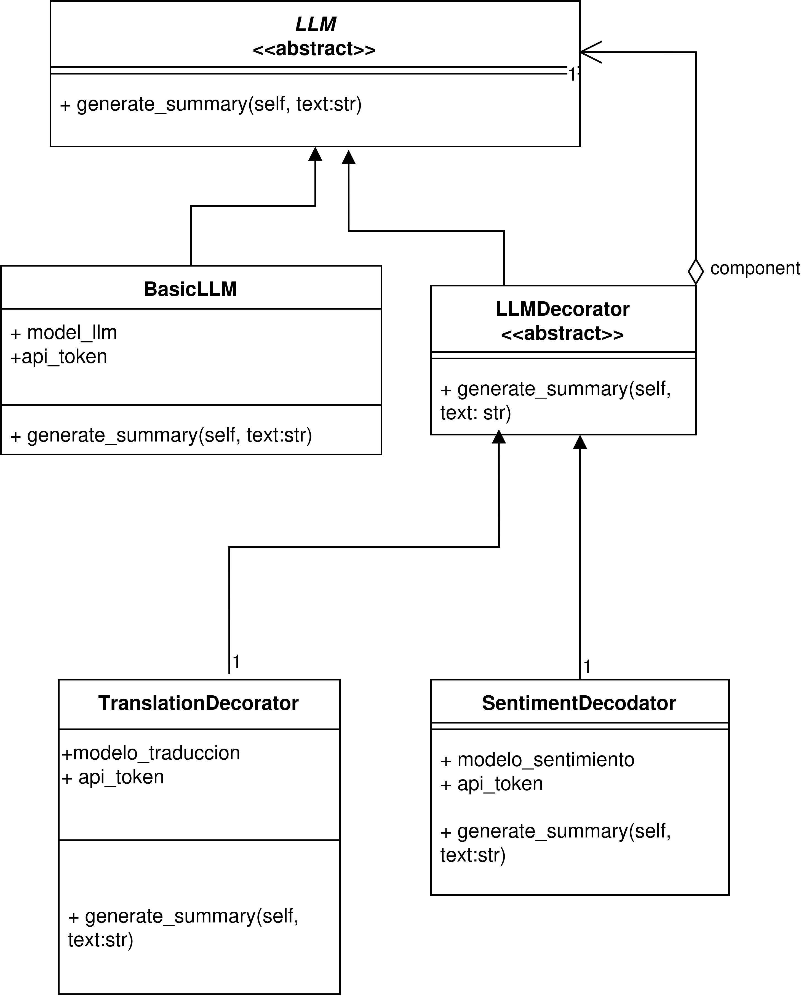

# Ejercicio 2. Patrón Decorador en Python.
***

El objetivo de este ejercicio es aplicar el patrón Decorador para que al ejecutar el main se realice un resumen de un texto, luego se traduzca de inglés a español y por último se imprima un análisis de sentimientos (calificado con estrellas). El patrón Decorador es un patrón estructural. Los patrones estructurales explican cómo ensamblar objetos y clases en estructuras más grandes y complejas, a la vez que se mantiene la flexibilidad y eficiencia de estas estructuras.

## 1.- Diagrama de clases en UML.
***

<div align="center">
  
</div>


## 2.- Entorno de Desarrollo
***

Este proyecto ha sido desarrollado y probado utilizando las siguientes herramientas:
- **Sistema Operativo:** Debian 13 trixie (Linux)
- **IDE:** Visual Studio Code
- **Lenguaje:** Python


## 3.- Ejecución
***
Para ejecutar este proyecto desde la terminal, sitúate dentro del directorio `codigo_ej2` y ejecuta el siguiente comando:

```bash
$ python Main.py
```