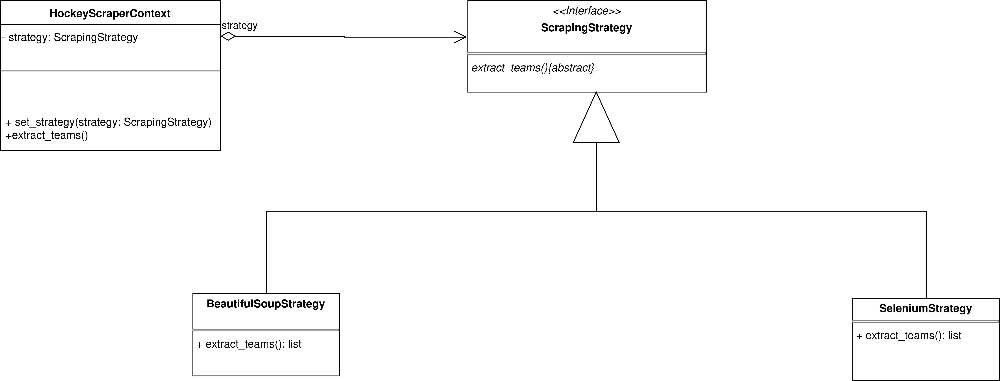

# Ejercicio 3. Patrón Estrategia en Python.

El objetivo del ejercicio es aplicar el patrón Strategy para permitir seleccionar en tiempo de ejecución (por consola) entre 2 métodos distintos de ***web scraping*** (obtener info de una página web): uno basado en *BeautifulSoup* y otro en *Selenium*, manteniendo desacoplada la lógica del contexto respecto a la implementación concreta. El **patrón Estrategia (Strategy)** es un patrón de comportamiento. Los patrones de comportamiento tratan con algoritmos para relacionar la forma en la que los objetos y clases se tratan o interactúan entre sí, repartiéndose responsabilidades. Este patrón Estrategia nos permite definir una familia de algoritmos, encapsularlos y hacerlos intercambiables en tiempo de ejecución según se necesiten.

## 1.- Diagrama de clases en UML.

<div align="center">
  
</div>


## 2.- Entorno de Desarrollo

Este proyecto ha sido desarrollado y probado utilizando las siguientes herramientas:
- **Sistema Operativo:** Debian 13 trixie (Linux)
- **IDE:** Visual Studio Code
- **Lenguaje:** Python


## 3.- Ejecución

Para ejecutar este proyecto desde la terminal, sitúate dentro del directorio `codigo_ej3` y ejecuta el siguiente comando:

```bash
$ python Main.py
```